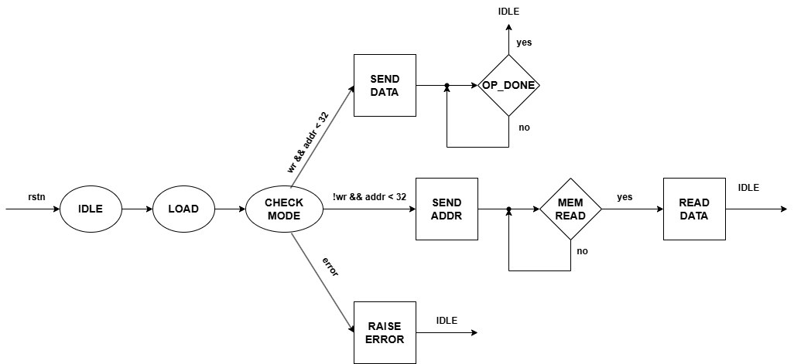
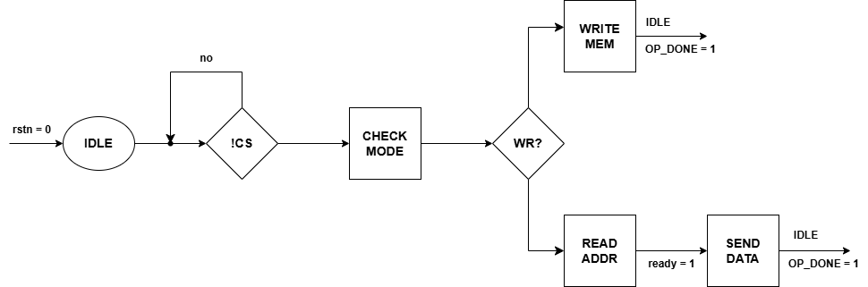

# SPI System Technical Specification (README)

**Version:** 1.0  
**Date:** April 14, 2025  
**Author:** Pham Bao Thanh  
**Major:** Electronics Engineering  
**University:** Hanoi University of Science and Technology

---

## Overview

This project implements an SPI-based memory system, composed of:

- **SPI Master (Controller):** Manages read/write operations via SPI.
- **SPI Slave (32 x 8-bit Memory):** Responds to the master's requests and handles memory access.

Communication between the SPI Master and Slave follows the standard SPI protocol using the signals: `mosi`, `miso`, `cs`, and `clk`.

---

### Block Diagram

---

## Functional Summary

- Perform 8-bit write operations to memory using SPI.
- Perform 8-bit read operations from memory using SPI.
- Address validity check (only addresses 0 to 31 are allowed).
- Error reporting for invalid memory accesses.

---

## Interface Signals

| Signal      | Direction        | Description                          |
|-------------|------------------|--------------------------------------|
| `clk`       | Input (both)     | System clock                         |
| `rtsn`      | Input (both)     | Active-low reset                     |
| `wr`        | Input (Master)   | Write enable (1 = write, 0 = read)   |
| `addr[7:0]` | Input (Master)   | Address (only 0 to 31 are valid)     |
| `din[7:0]`  | Input (Master)   | Data to be written                   |
| `dout[7:0]` | Output (Slave)   | Data read from memory                |
| `mosi`      | Output/Input     | SPI data line Master Out Slave In    |
| `miso`      | Output/Input     | SPI data line Master In Slave Out    |
| `cs`        | Output (Master)  | Chip select for SPI slave            |
| `ready`     | Output (Slave)   | Indicates data is ready (read)       |
| `done`      | Output (Slave)   | Indicates memory operation complete  |
| `op_done`   | Output (Master)  | Indicates transaction complete       |
| `error`     | Output (Slave)   | Set when invalid address is accessed |

---

## SPI Master State Machine

### State Diagram

1. **IDLE**
   - Waits for `rtsn = 0` or `op_done = 1` to reset or complete.

2. **LOAD / !CS**
   - Detects start of a transaction.

3. **CHECK MODE**
   - Checks `wr` signal and validates address.

4. **SEND DATA**
   - Writes `din` to Slave via SPI (`mosi`) if `wr = 1`.

5. **SEND ADDR**
   - Sends address to Slave for read access.

6. **MEM READ**
   - Waits until `ready = 1` to receive data.

7. **READ DATA**
   - Reads data from `miso`.

8. **OP_DONE**
   - Transaction complete. Returns to `IDLE`.

9. **RAISE ERROR**
   - Address is invalid. Activates `error` and returns to `IDLE`.

---

## SPI Slave (Memory) State Machine

### State Diagram

1. **IDLE**
   - Waits for chip select `cs = 0`.

2. **!CS**
   - Activates transaction.

3. **CHECK MODE**
   - Checks if operation is write (`wr = 1`) or read.

4. **WRITE MEM**
   - Receives data from `mosi`, stores at the specified address.

5. **READ ADDR**
   - Receives address.

6. **SEND DATA**
   - Sends data from memory via `miso`, sets `ready = 1`.

7. **OP_DONE**
   - Completes the transaction and returns to `IDLE`.

---

## Error Handling

- If the address is >= 32, the system:
  - Sets `error = 1` on the Slave side.
  - Master transitions to `RAISE ERROR`.
  - Skips read/write and returns to `IDLE`.

---

## Operation Expectations

- SPI Master controls all transactions.
- SPI Slave responds only when `cs = 0`.
- `op_done` is raised after each successful operation.
- System is synchronized with `clk`.
- `rtsn = 0` resets the system.
- Slave indicates read data availability with `ready = 1`.
- Safe handling of out-of-range addresses.

---

This specification ensures that the SPI memory system behaves predictably, handles errors safely, and allows for structured verification in simulation environments.

