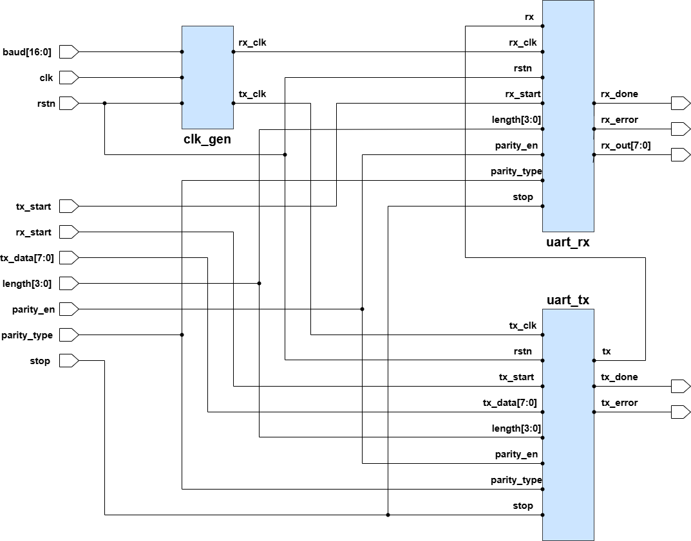

# UART Module Specification

**Version:** 1.0  
**Date:** April 14, 2025  
**Author:** Phạm Bảo Thành  
**Major:** Electronics Engineering  
**University:** Hanoi University of Science and Technology



---

## Overview

This document describes the specifications for the UART system, which includes a transmitter (`uart_tx`), receiver (`uart_rx`), and clock generator (`clk_gen`). It is intended for use by verification engineers writing testbenches.

---

## System Parameters

- **System Clock Frequency:** 50 MHz
- **Reset Signal (`rstn`):** Active-low
- **Default Baudrate:** 115200 bps
- **Data Length (`length`):** Configurable from 5 to 8 bits
- **Parity Control:**
  - `parity_en = 1`: Parity check enabled
  - `parity_en = 0`: No parity
  - `parity_type = 0`: Even parity
  - `parity_type = 1`: Odd parity
- **Stop Bit (`stop`):**
  - `stop = 0`: 1 stop bit
  - `stop = 1`: 2 stop bits

---

## UART Transmitter (`uart_tx`)

### Inputs:

| Signal         | Description                                           |
| -------------- | ----------------------------------------------------- |
| `tx_clk`       | Clock signal for transmission (from `clk_gen`)        |
| `rstn`         | Active-low reset                                      |
| `tx_start`     | Start transmission pulse (1 cycle)                    |
| `tx_data[7:0]` | Data to transmit (MSBs ignored depending on `length`) |
| `length[3:0]`  | Data bit length (5 to 8 bits)                         |
| `parity_en`    | Enable parity bit                                     |
| `parity_type`  | Select parity type (even/odd)                         |
| `stop`         | Number of stop bits                                   |

### Outputs:

| Signal     | Description           |
| ---------- | --------------------- |
| `tx`       | UART TX output        |
| `tx_done`  | Transmission complete |
| `tx_error` | Transmission error    |

### Data Bit Mapping:

| Length | Valid Bits in `tx_data` |
| ------ | ----------------------- |
| 5      | `tx_data[4:0]`          |
| 6      | `tx_data[5:0]`          |
| 7      | `tx_data[6:0]`          |
| 8      | `tx_data[7:0]`          |

---

## UART Receiver (`uart_rx`)

### Inputs:

| Signal        | Description                                   |
| ------------- | --------------------------------------------- |
| `rx_clk`      | Clock signal for reception (from `clk_gen`)   |
| `rstn`        | Active-low reset                              |
| `rx_start`    | Enable reception (held high during operation) |
| `rx`          | UART RX input                                 |
| `length[3:0]` | Data bit length (5 to 8 bits)                 |
| `parity_en`   | Enable parity bit                             |
| `parity_type` | Select parity type (even/odd)                 |
| `stop`        | Number of stop bits                           |

### Outputs:

| Signal        | Description          |
| ------------- | -------------------- |
| `rx_done`     | Reception complete   |
| `rx_error`    | Reception error      |
| `rx_out[7:0]` | Received data output |

---

## Clock Generator (`clk_gen`)

### Inputs:

| Signal       | Description                  |
| ------------ | ---------------------------- |
| `clk`        | System clock (50 MHz)        |
| `rstn`       | Active-low reset             |
| `baud[16:0]` | Baudrate configuration value |

### Outputs:

| Signal   | Description           |
| -------- | --------------------- |
| `tx_clk` | Transmit clock output |
| `rx_clk` | Receive clock output  |

**Note:** Baudrate clock generation formula:

```
baud = clk_freq / (baudrate * oversample)
where oversample = 16
```

Example: `baud = 50_000_000 / (115200 * 16) ≈ 27`
